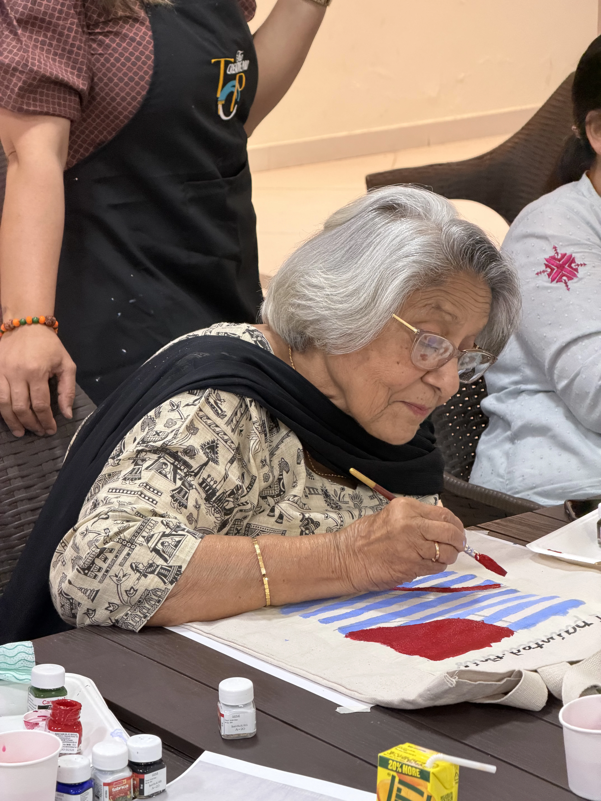

# What Is Creative Ageing? A Complete Guide for Adults Over 50

## The Moment Everything Changed

When Sandhya Vyas walked into the fourth Art Beyond Age workshop, she was 80 years old and completely unbothered by that fact.

She had never painted before. She had spent most of her life raising a family, managing a household, and quietly putting her own curiosity on hold. But something about the idea of an art workshop had caught her attention, and Sandhya, as anyone who knows her will tell you, has never needed much persuading to say yes to something new.

She arrived early. She asked questions. She tried things that did not work, laughed about it, and tried again. By the end of the session, she had produced a small watercolour that she held up with the kind of unguarded pride that most of us lose somewhere in childhood. She was not worried about whether it was good. She was delighted that she had made it at all.

That openness, that willingness to begin something without knowing where it leads, is not a personality quirk. It is, the science is beginning to tell us, one of the most powerful things an older adult can do for their own wellbeing. It is the first step in what is now called creative ageing.

That feeling has a name. It is called creative ageing.

---

## So, What Is Creative Ageing?

Creative ageing is a professional framework and growing global movement built on one central idea: that creativity is not something we age out of. It is something we grow into, if we are given the right environment to do so.

The term was developed and formalised by organisations including [Lifetime Arts](https://lifetimearts.org/why/creative-aging/) and the [National Assembly of State Arts Agencies (NASAA)](https://nasaa-arts.org/nasaa_research/creative-aging/), both of which have spent years building evidence-based models for delivering arts programmes specifically designed for older adults.

Lifetime Arts defines creative ageing as "professional-quality, participatory arts programming intentionally designed to engage older adults." The key words there are "professional-quality" and "intentionally designed." Creative ageing is not a hobby hour or a gentle distraction. It is a structured, facilitated approach to artistic practice that takes the participant seriously as a creative person, regardless of prior experience.

NASAA describes it as a field grounded in the belief that "creativity is ageless and that older adults deserve access to high-quality arts experiences." In 2025, the organisation awarded $1.44 million to expand creative ageing programmes across the United States, reflecting the scale of investment this field is now attracting internationally.

In the UK, organisations such as [Luminate Scotland](https://luminatescotland.org/using-the-arts-as-a-social-intervention-tool/) and [Arts Council England](https://www.arts.gov/impact/accessibility/creativity-and-aging) have championed similar frameworks, establishing creative ageing as a recognised strand of arts policy and public health strategy.

At its heart, creative ageing is about one thing: giving older adults the space, skills, and community to express themselves fully, at every stage of life.

---

## What the Science Actually Says

For a long time, the value of creative activity in later life was treated as self-evident but largely anecdotal. You did not need a clinical trial to know that people felt better after making something with their hands. But the research has now caught up, and the picture it paints is striking.

### The Nature Mental Health Meta-Analysis (2025)

One of the most significant studies in this field is a large-scale meta-analysis published in [*Nature Mental Health*](https://www.nature.com/articles/s44220-024-00368-1) in 2025. Analysing data across multiple group arts intervention trials, the researchers found that participation in group arts programmes was associated with a moderate reduction in both depression and anxiety in older adults.

This was not a marginal finding. A moderate effect size, in clinical terms, is clinically meaningful. It means that creative group activities produced measurable psychological benefits comparable to many other recommended wellbeing interventions. For adults who may be managing low mood, social withdrawal, or the emotional turbulence that often follows retirement, this is significant news.

### The National Institute on Ageing

The [National Institute on Ageing (NIA)](https://www.nia.nih.gov/news/participating-arts-creates-paths-healthy-aging) has stated clearly that "participating in the arts creates paths to healthy ageing," citing improvements in cognitive function, memory, and self-esteem across multiple study populations. These are not soft outcomes. They are measurable changes in how people think, remember, and feel about themselves.

### PMC Scoping Reviews

A [scoping review published on PubMed Central](https://pmc.ncbi.nlm.nih.gov/articles/PMC9549330/), examining the breadth of research into creativity and art therapies for healthy ageing, found consistent evidence across studies that artistic participation supports emotional regulation, social connection, and a strengthened sense of identity in older adults. The review also noted that group artistic activities "stimulate socialisation, which mitigates the perception of loneliness," a finding that matters enormously given the scale of social isolation among older people in the UK today.

It is also worth noting a 2025 randomised controlled trial published in [*Frontiers in Aging*](https://www.frontiersin.org/journals/aging/articles/10.3389/fragi.2025.1635789/full), which found measurable cognitive and emotional benefits in healthy older adults who completed a structured digital visual art learning programme, even among participants with no prior artistic experience whatsoever. The creative ageing benefits are not reserved for people who already consider themselves artists.

---

## Why Creative Ageing Matters More Than Ever

If the science is this clear, why are so many older adults still not engaging with the arts? The answer lies in a confluence of social, psychological, and structural factors that creative ageing programmes are specifically designed to address.

### The Retirement Identity Shift

Retirement is, for many people, a profound psychological event. When a career ends, so does a significant source of identity, routine, status, and social connection. Research consistently shows that the loss of professional identity is one of the most challenging aspects of later life, and that older adults with a strong sense of purpose and self-expression fare significantly better in terms of mental and physical health.

Art offers something rare: a new identity. Not "retired teacher" or "former engineer," but artist, maker, creator. The shift is not trivial.

### The Loneliness Epidemic

According to the UK Office for National Statistics, 3.83 million older adults in the UK report feeling lonely often. Among those who live alone, 46% say that not having someone to do activities with is one of the main barriers to participation in leisure and cultural life.

Creative ageing programmes address this directly. They are, by design, communal. They bring people together around a shared creative focus, in an environment where conversation is natural and judgement is absent. Research on [art and loneliness in retirement](/blog/art-loneliness-retirement-connection) shows that the social dimension of creative workshops may be as beneficial as the artistic one.

### The Participation Gap

Despite all the evidence, approximately 50% of older adults attend arts events less frequently than they did in their younger years. Barriers include cost, transport, lack of confidence, and the persistent cultural myth that creativity is a young person's domain.

Creative ageing as a framework pushes back on every one of those barriers. It brings programmes to communities, removes the pressure of performance, and grounds the experience in inclusion rather than expertise.

---

## What Creative Ageing Looks Like in Practice

Creative ageing is not one thing. It is a broad field encompassing a wide range of artistic disciplines and programme formats, each adapted to suit older participants.

**Visual art workshops** (painting, drawing, printmaking, collage, and mixed media) are among the most accessible and widely practised. They require no prior skill, offer immediate creative satisfaction, and are well-supported by the research base for both [cognitive health](/blog/art-brain-health-over-50) and emotional wellbeing.

**Music programmes**, from choir singing to instrumental workshops, tap into deep memory and emotional resonance. Singing in a group, in particular, has a substantial evidence base for reducing social isolation and improving mood.

**Storytelling and creative writing** sessions give participants a structured way to process memory, articulate identity, and share experience with others. For many older adults, this is also a way of leaving something behind, a legacy of voice.

**Textile and craft** workshops, including weaving, embroidery, and ceramics, combine fine motor engagement with tactile satisfaction and a strong tradition of community practice.

In all of these formats, the essential ingredients are the same: professional facilitation, a non-judgemental environment, and a focus on process over product. The goal is never to produce gallery-worthy work. It is to produce people who feel more alive, more connected, and more themselves.

---

## Art Beyond Age and the Creative Ageing Approach

At Art Beyond Age, everything we do is shaped by the principles of creative ageing. Our workshops are not classes in the traditional sense. We do not grade, rank, or compare. We do not expect any prior experience or any particular level of skill.

What we offer is a professionally facilitated creative space designed specifically for adults aged 50 and over, grounded in the evidence base described above. Our facilitators understand the particular joys and particular challenges of this life stage, and they create sessions that feel warm, safe, and genuinely engaging.

We work across multiple mediums because we know that one size does not fit all. Whether you have never held a paintbrush or whether you sketched a little years ago and always meant to return to it, there is a session here that will meet you where you are.

We also believe in the social dimension of this work. The community that forms in a creative ageing workshop is real. The friendships that begin over a shared table, over the small shared drama of whether the watercolour is going to dry in time, these are not incidental. They are part of the point.

---

## The Bigger Picture

Creative ageing is not a trend. It is a field with deep roots, growing evidence, and serious institutional backing. It is also, at its most human level, a simple and profound proposition: that the desire to make something, to express, to connect, and to contribute does not diminish with age.

If anything, it deepens.

The adults who walk into an Art Beyond Age workshop for the first time, nervous, uncertain, not quite sure why they came, often find something there that surprises them. Not just a pleasant afternoon. A version of themselves they had not met before.

---

## Start Your Creative Ageing Journey

If you have been curious about what creative ageing might mean for you personally, the best place to start is simply to try it.

Browse our [upcoming workshops](/workshops) and find a session that appeals. No experience is needed. No special equipment is required. Just bring yourself, exactly as you are.

You might also enjoy reading about [how art workshops help with loneliness and social connection after retirement](/blog/art-loneliness-retirement-connection), or exploring [what the science says about art and brain health over 50](/blog/art-brain-health-over-50).

We would love to see you there.
